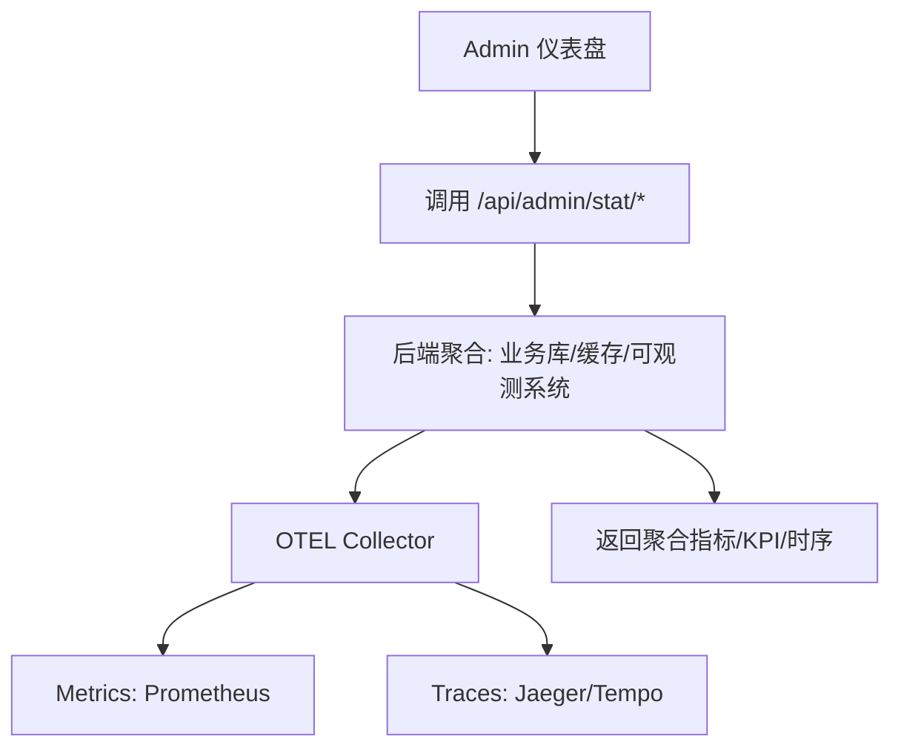

# blog-system-web

个人博客系统前端（前台 + 管理后台）。基于 Next.js App Router 与现代前端工程栈，强调清晰的模块边界与最小依赖的可观测接入方案。

## 技术栈
- 框架: Next.js 14（App Router）+ TypeScript
- UI/组件: Ant Design 5 + 自定义 Tailwind 组件类（`globals.css`）
- 数据: TanStack Query 5（请求/缓存/状态）+ Axios
- 状态: Zustand（轻量登录态）
- 样式: TailwindCSS（实用类 + 约定化组件类）

## 关键特性
- 鉴权与路由保护: 通过 `middleware.ts` 校验 `access_token` Cookie，未登录访问 `/admin/*` 与 `/profile` 将被重定向至登录页。
- 管理后台: 统一布局与高亮侧边导航，仪表盘展示基础 KPI、PV 趋势、错误率、活跃用户、延迟分位数与 Top Endpoints。
- 最小依赖图表: 使用原生 SVG 渲染轻量折线图，必要时可平滑替换为 `@ant-design/plots`/ECharts。
- 服务抽象: `services/*` 统一封装 API；`lib/http.ts` 管理 Axios 实例与 token 注入。

## 架构总览
```mermaid
graph TD
  A[浏览器] --> B[Next.js App Router]
  B --> C[middleware.ts 路由保护]
  B --> D[页面/布局]
  D --> E[React Query]
  E --> F[services/*]
  F --> G[lib/http.ts (Axios)]
  G --> H[后端 API 网关]
```



## 目录结构
```text
src/
  app/
    (public)/posts/        # 前台文章
    admin/                 # 后台：仪表盘/用户/文章/分类
      layout.tsx
      page.tsx
    auth/login/            # 登录页
    api/health/            # 健康检查
  components/
    admin/
      Charts.tsx           # 轻量图表组件（SVG 折线）
      Filters.tsx          # 时间范围 + 服务选择器
      KpiCard.tsx          # KPI 卡片
  config/
    app.ts                 # API 基础地址
  providers/
    Providers.tsx          # AntD + React Query Provider
  services/
    admin.service.ts
    content.service.ts
    user.service.ts
    stat.service.ts        # 仪表盘统计接口封装
  stores/
    auth.store.ts          # 登录态：Cookie + localStorage
  lib/
    http.ts                # Axios 实例与拦截器
    date-range.ts          # 时间范围与粒度
    query-keys.ts          # React Query 的 queryKey 约定
  types/
    user.ts
```

## 快速开始
- 安装依赖:
```bash
npm i
```
- 环境变量（`.env.local`）:
```bash
# 后端 API 网关地址（可选，默认 http://localhost:8000）
NEXT_PUBLIC_API_BASE_URL=http://localhost:8000
```
- 本地开发:
```bash
npm run dev
```
- 生产构建与启动:
```bash
npm run build
npm start
```

## 鉴权与访问控制
- 登录: 成功登录后，`useAuthStore.setAuth()` 将写入 `access_token` Cookie 与 store。
- 路由保护: `middleware.ts` 保护 `/admin/:path*` 与 `/profile`，未登录跳转到 `/auth/login?next=...`。
- 请求注入: `lib/http.ts` 在浏览器向请求头附加 `Authorization: Bearer <token>`。

```mermaid
graph TD
  V[访问 /admin] --> M{Cookie: access_token?}
  M -->|无| L[/auth/login?next=/admin]
  M -->|有| P[渲染 Admin 页面]
```

## 仪表盘与统计接口（后端已实现）
- 概览: `GET /api/admin/stat/overview`
  - 返回: `{ pv_today, uv_today, online_users, article_total, category_total, error_5xx_last_1h }`
- PV 时序: `GET /api/admin/stat/pv_timeseries?from&to&interval`（`5m|1h|1d`）
- 扩展接口:
  - `GET /api/admin/stat/error_rate?from&to&service`
  - `GET /api/admin/stat/latency_percentile?from&to&service`（P50/P90/P95/P99）
  - `GET /api/admin/stat/top_endpoints?from&to&service`
  - `GET /api/admin/stat/active_users?from&to`

前端封装见 `src/services/stat.service.ts`，页面位于 `src/app/admin/page.tsx`。

## 样式与 UI 约定
- Tailwind 组件类位于 `src/app/globals.css`：
  - `container-app`、`card`、`nav-link`、`sidebar`、`sidebar-link(-active)` 等
- 侧边导航高亮：`src/app/admin/layout.tsx` 使用 `usePathname()` 判断当前路由。

## 部署
- 脚本: `deploy/linux/npm_env.sh`、`deploy/linux/deploy_web.sh`
- 直连部署（最小化，适合轻量服务器）:
```bash
cd /opt/blog-system-web
chmod +x deploy/linux/npm_env.sh deploy/linux/deploy_web.sh
./deploy/linux/npm_env.sh
APP_PORT=80 NEXT_PUBLIC_API_BASE_URL=https://api.example.com \
  ./deploy/linux/deploy_web.sh
```
- 生产建议接入前置网关（Nginx/APISIX）与 HTTPS，可在启动时注入 `NEXT_PUBLIC_API_BASE_URL` 指向后端网关。

## 开发约定
- 模块化: 页面只编排，逻辑下沉至 `services/*` 与可复用组件。
- 命名: 函数/变量使用完整含义命名，减少缩写。
- 错误处理: 统一在 `lib/http.ts`/调用侧细化转换。
- 可观测性: 前端不直连 OTEL，由后端聚合输出少量指标，前端消费即可。

## 许可
本项目为个人项目脚手架，可自由克隆与二次开发。